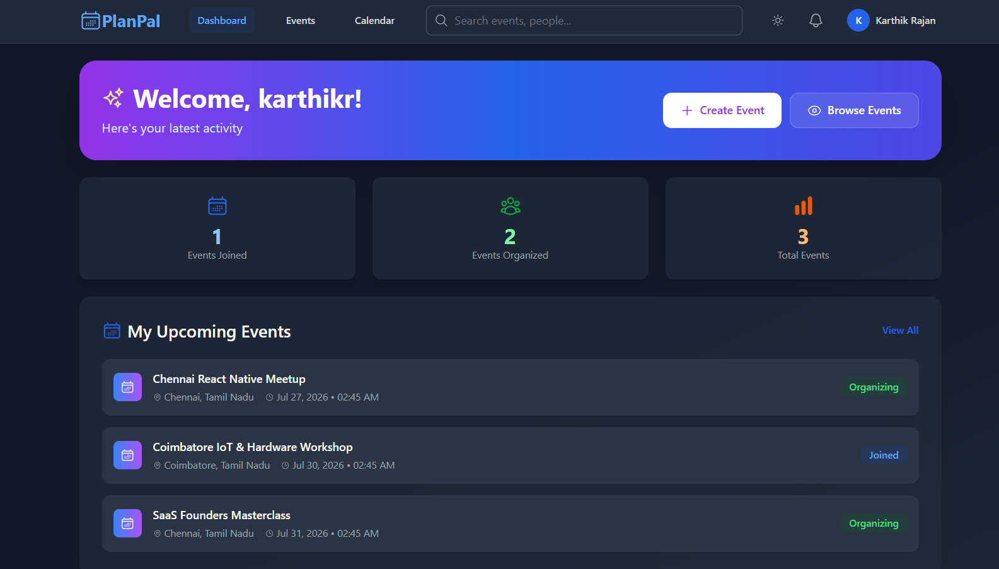
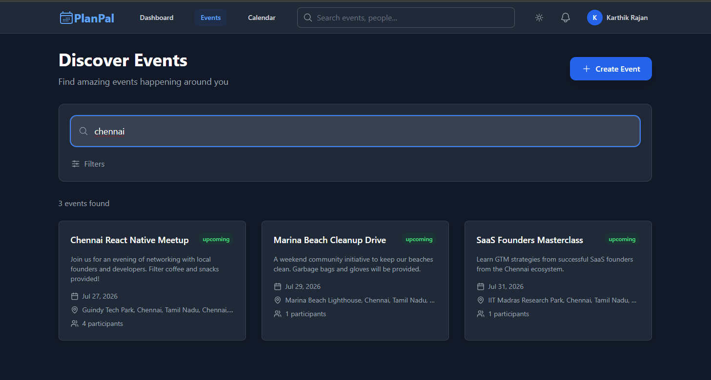
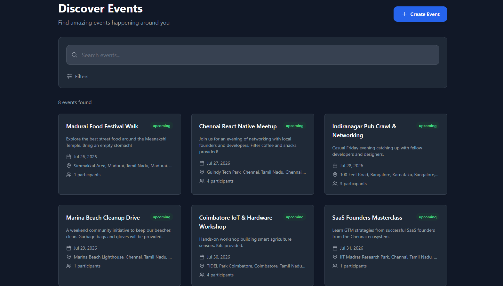
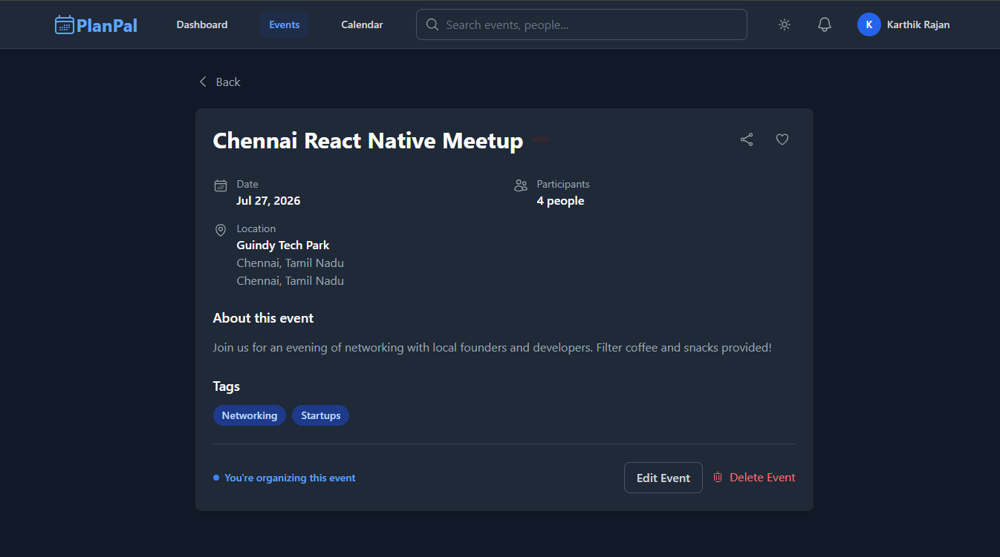
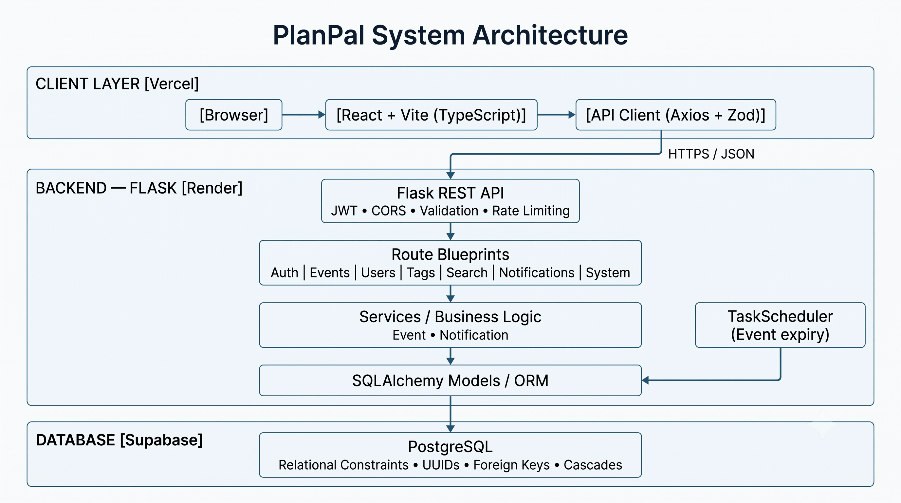

# PlanPal

[](https://github.com/nitheshkummarc/PlanPal/actions)


A deployed full-stack event management platform built with **React, TypeScript, Flask, and PostgreSQL on Supabase**, featuring JWT authentication, role- and ownership-based authorization, relational integrity constraints, event participation workflows, automated testing, and CI/CD.

[Architecture](#system-architecture) • [Engineering Highlights](#engineering-at-a-glance) • [API](#api-surface) • [Run Locally](#quick-start)

---

## Live Demo

**Frontend (Vercel):** [https://planpal-silk.vercel.app](https://planpal-silk.vercel.app)  
**Backend API Health (Render):** [https://planpal-backend-wcsc.onrender.com/api/system/health](https://planpal-backend-wcsc.onrender.com/api/system/health)

---

## Engineering at a Glance

- **44 REST API endpoints** covering authentication, events, participation, notifications, tags, users, and system health
- **68 automated tests** — 41 backend tests with pytest and 27 frontend tests
- **JWT authentication and authorization** with role- and ownership-based access control
- **PostgreSQL relational model** using UUIDs, foreign keys, composite keys, uniqueness constraints, and cascades
- **Rate limiting** on authentication endpoints (5 requests/minute per IP) using Flask-Limiter
- **Background maintenance** through a threaded `TaskScheduler` that handles event expiration outside request processing
- **CI/CD workflow** with GitHub Actions for automated validation and Vercel/Render for deployment
- **Explicit CORS allow-list** restricted to approved production origins
- **Health and readiness endpoints** for deployment health checks

---

## Product Preview

### 1. Dashboard & Upcoming Events


### 2. Event Search


### 3. Event Details & Organizer Controls


### 4. Event Discovery


---

## System Architecture



The React client communicates with the Flask REST API through an Axios-based API layer. The backend validates requests and enforces authentication and authorization across its route blueprints, while service-layer logic handles application workflows and persists data through SQLAlchemy models backed by PostgreSQL. A background `TaskScheduler` handles periodic event expiration independently of request processing.

---

## Key Engineering Decisions

**Schema-driven integrity**
Core integrity rules such as unique event participation, tag relationships, and cascade behavior are enforced at the database layer rather than relying solely on application or UI validation.

**Layered Authorization**
Protected operations require JWT authentication and enforce role- or resource-ownership checks on the backend. Client-side route restrictions are treated as UI behavior rather than a security boundary.

**Background Maintenance**
A threaded `TaskScheduler` runs periodically to mark expired events inactive, decoupling cleanup operations from request-time logic.

**Safe Error Responses & Validation**
API payloads are validated against Zod schemas on the frontend before transmission. The backend independently validates requests and returns client-safe error messages while logging internal exceptions server-side without exposing raw exception details.

**Explicit CORS Allow-list**
The backend uses an explicit allowed-origins list when credentials are enabled, avoiding wildcard origins for credentialed requests.

---

## ER Diagram


Key database rules defined in `database/supabase_migration.sql`:
- One participation per user per event
- Event and user tags use composite primary keys
- Event tags and participations cascade when an event is deleted
- Notification event references are nullable and use `ON DELETE SET NULL`
- Event `source_type` is constrained to valid schema values

---

## Tech Stack

| Layer | Technology |
| --- | --- |
| Frontend | React, TypeScript, Vite, Vanilla CSS, Axios, React Router, Zod |
| Backend | Python 3.11, Flask, Flask-JWT-Extended, Werkzeug Security, Flask-CORS, SQLAlchemy |
| Database | PostgreSQL (Supabase) |
| Infrastructure | Docker (Local Dev), Vercel (Frontend Hosting), Render (Backend PaaS) |
| Tooling | pytest, npm, pip, GitHub Actions |

---

## Quick Start

### Prerequisites

- Python 3.11+
- Node.js 20+
- PostgreSQL database or Supabase project
- Docker & Docker Compose (Optional but recommended)

### 1. Backend

```bash
cd backend
python -m venv .venv
source .venv/bin/activate  # On Windows use: .venv\Scripts\activate
pip install -r requirements.txt
cp .env.example .env       # On Windows use: copy .env.example .env
python run.py
```

Update `backend/.env` with your database and JWT secrets before starting the API.
Expected API URL: `http://localhost:5000`

### 2. Database

Run the migration SQL against your Supabase project to initialize the schema manually.

```text
database/supabase_migration.sql
```
*(Note: Database access is mediated exclusively through the Flask backend, where authentication and authorization are enforced before database operations; privileged Supabase credentials are never exposed to the client).*

### 3. Frontend

```bash
cd frontend
npm install
cp .env.example .env       # On Windows use: copy .env.example .env
npm run dev
```

Expected frontend URL: `http://localhost:5173`

---

## Testing

| Suite | Result |
| --- | ---: |
| Backend | 41 tests passing |
| Frontend | 27 tests passing |
| Frontend production build | Passing |
| GitHub Actions CI | Passing |

**Run Backend Tests:**
```bash
pytest backend/tests -q
```

**Run Frontend Tests:**
```bash
cd frontend
npm test
npm run build
```

---

## API Surface

| Area | Endpoints |
| --- | --- |
| Auth | register, login, profile, change password |
| Events | list, create, detail, update, delete, join, leave, participation status |
| Notifications | list, create, mark read, delete |
| Tags | list, detail, create, update, delete (admin-protected mutations) |
| Users | current profile, user detail |
| System | health and readiness endpoints (`/api/system/health`, `/api/system/ready`) |

*Most protected routes require a JWT access token in the `Authorization: Bearer <token>` header.*

---

## Repository Layout

```text
backend/
  app/
    models/       SQLAlchemy models
    routes/       Flask route blueprints
    services/     Event, notification, and scheduler logic
    utils/        Validation, response, security, and Supabase helpers
  tests/          pytest API contract tests
  config.py       Flask configuration
  run.py          Local API entrypoint

database/
  supabase_migration.sql
  supabase_rls_policies.sql      Optional/legacy RLS policy definitions

frontend/
  src/
    api/          Frontend API clients
    components/   Shared UI and layout components
    context/      Auth and theme context
    pages/        Route-level React pages
    schemas/      Zod validation schemas

docs/
  ARCHITECTURE.md                    System architecture deep dive
  FILE_DOCUMENTATION.md              File-by-file project overview
  ROUTE_DOCUMENTATION.md             Function-level route documentation
  EVENT_ROUTES_ORM_SQL_REFERENCE.md  ORM-to-SQL mapping for event routes
```
