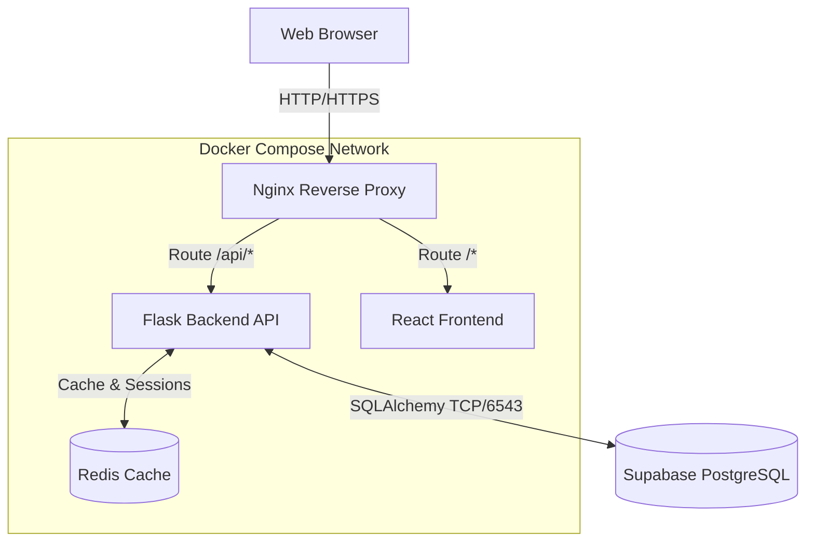

# PlanPal+ System Architecture

This document outlines the high-level architecture, design decisions, and data flow of the PlanPal+ application. The system is designed to be highly scalable, secure, and developer-friendly.

## 1. High-Level Architecture

PlanPal+ follows a containerized, decoupled architecture separating the client-side rendering from the server-side business logic and data persistence.

## 2. Component Deep Dive

### 2.1 Frontend (React + Vite)
- **Framework:** React 18 for component-based UI building.
- **Bundler:** Vite provides sub-second HMR (Hot Module Replacement) and highly optimized production builds.
- **Routing:** Client-side routing managed by `react-router-dom` ensuring a SPA (Single Page Application) experience without page reloads.
- **State Management:** Context API combined with local component state.
- **Styling:** Custom CSS with a robust CSS variable system for consistent theming and dark mode support.

### 2.2 Backend (Flask)
- **Framework:** Python Flask provides a lightweight, unopinionated WSGI framework.
- **Authentication:** `flask-jwt-extended` handles JWT (JSON Web Token) generation and validation. Tokens are stored securely and verified on protected routes.
- **Security:** Passwords are never stored in plaintext. They are hashed using `scrypt` (via Werkzeug Security) with a work factor designed to deter brute-force attacks.
- **Task Scheduling:** A background daemon thread handles periodic maintenance, such as expiring past events automatically.

### 2.3 Database Layer (Supabase / PostgreSQL)
- **Hosting:** Fully managed PostgreSQL hosted on Supabase (Mumbai Region for ultra-low latency).
- **ORM:** SQLAlchemy maps Python objects to database tables, preventing SQL injection and simplifying complex relational queries.
- **Connection Pooling:** We leverage SQLAlchemy's `QueuePool` in conjunction with Supabase's Transaction Pooler (PgBouncer/Supavisor on port 6543) to guarantee extreme connection stability and sub-10ms query times.

### 2.4 Infrastructure & Routing (Nginx)
Nginx sits at the edge of our Docker network. It serves two critical functions:
1. **Static File Serving:** Delivers the built React assets (`index.html`, CSS, JS) at lightning speed.
2. **Reverse Proxy:** Intercepts any request starting with `/api/` and routes it to the Flask backend container, effectively eliminating CORS issues and hiding the backend port from the public internet.

## 3. Data Flow Example: User Registration

1. The user fills out the registration form on the React frontend.
2. React sends a `POST` request to `/api/auth/register` with a JSON payload.
3. Nginx receives the request on port 80 and proxies it to the Backend container on port 5000.
4. Flask validates the payload, hashes the password using `scrypt`, and attempts to create a new User model.
5. SQLAlchemy requests a connection from its `QueuePool`.
6. The connection pooler (Supavisor) authenticates the TCP connection to the PostgreSQL instance.
7. The record is inserted. If the email is unique, a 201 Created response is sent back, containing a fresh JWT.
8. The frontend stores the JWT and redirects the user to the dashboard.

## 4. Scalability Considerations
- **Stateless Backend:** Because authentication relies on JWTs rather than server-side memory sessions, the Flask backend can be horizontally scaled infinitely behind a load balancer.
- **Database Connection Limits:** Supabase handles connection pooling at the edge, meaning thousands of concurrent backend instances will not exhaust PostgreSQL's internal connection limits.
