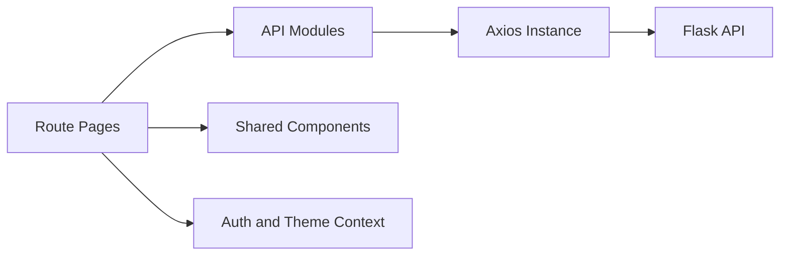

# PlanPal Frontend

React frontend for PlanPal, a full-stack event planning application.

This client handles authentication screens, event discovery, event creation/editing, notifications, search, dashboard, profile, and calendar views. It is intentionally structured around API client modules so backend route contracts stay visible and page components remain focused on UI state.

---

## What This Frontend Does

- Authenticates users through the Flask API and stores JWTs through a token service.
- Renders protected and public routes with React Router.
- Provides event browse, detail, create, edit, join, and leave flows.
- Uses tag data for event filtering and profile interests.
- Displays notification list/bell interactions backed by notification endpoints.
- Uses a shared Axios instance for API base URL and request behavior.
- Keeps reusable UI pieces such as event cards, tag chips, loading states, and layout components separate from pages.

---

## Frontend Architecture



The frontend is organized around route-level pages under `src/pages`. Pages call functions from `src/api`, which route all HTTP requests through `src/services/axiosInstance.ts`. Shared state lives in React context providers, and reusable UI is grouped under `src/components`.

---

## Tech Stack

| Technology | Role |
| --- | --- |
| React | Component-based UI and page composition |
| Vite | Local dev server and production build |
| React Router | Client-side routing and protected route flows |
| Axios | HTTP client for backend API calls |
| Tailwind CSS | Utility-first styling |
| Heroicons / Lucide React | Icon system |
| react-hot-toast | User-facing success/error feedback |

---

## Project Structure

```text
src/
  api/          Backend API client modules
  components/   Layout, route guards, and reusable UI
  context/      Auth and theme providers
  hooks/        Shared React hooks
  pages/        Route-level screens
  services/     Axios, token, and browser-side services
  styles/       Global CSS
  utils/        Validation, date, and helper functions
```

---

## Setup

```bash
cd frontend
npm install
copy .env.example .env
npm run dev
```

Default local URL:

```text
http://localhost:5173
```

Environment variable:

```env
VITE_API_BASE_URL=http://localhost:5000
```

---

## Available Scripts

```bash
npm run dev      # Start local Vite server
npm run build    # Build production assets
npm run preview  # Preview production build locally
npm run lint     # Run ESLint
```

---

## API Boundary

Frontend API modules live in `src/api`:

```text
authApi.ts
eventsApi.ts
notificationsApi.ts
searchApi.ts
systemApi.ts
tagsApi.ts
usersApi.ts
```


